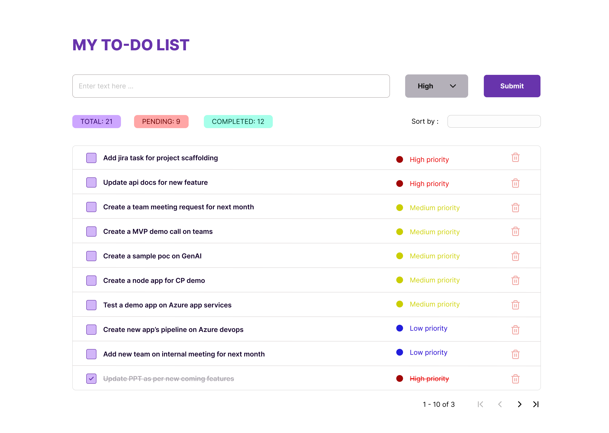

# my-todo-js-app

A ToDo app created in pure JavaScript, HTML and CSS (without any external packages or libraries). Adding sample wireframe below created in figma.

A simple ToDo app that allows a user to add todo tasks with priority. The following actions can be performed on this app.

- Add new tasks with priority
- Complete task by check it
- Remove task from the list
- Sort the list

## Feature scope

- Required pagination
- DB/API integration
- Filtering
- Edit/Update task
